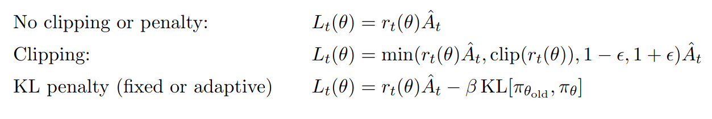
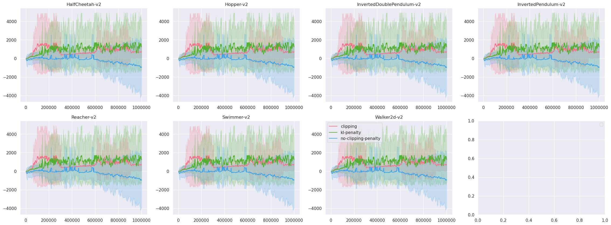
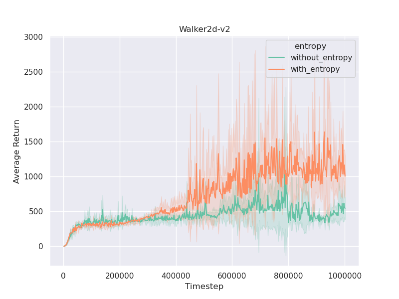
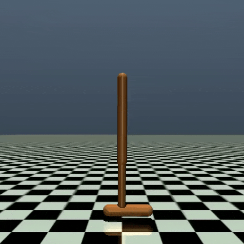
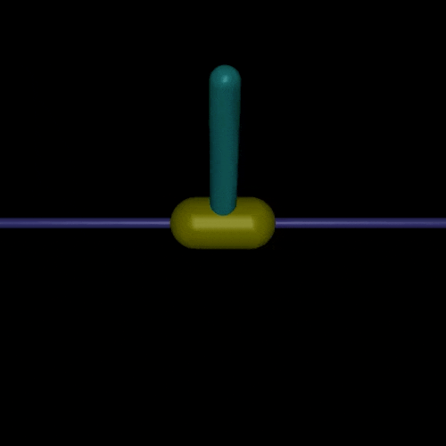
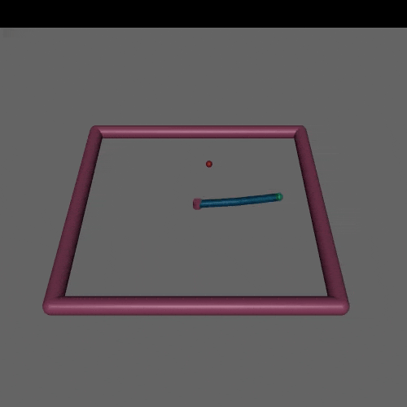
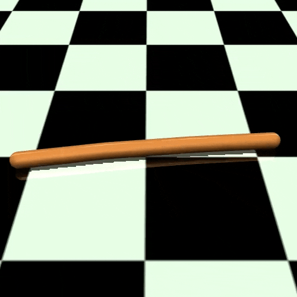
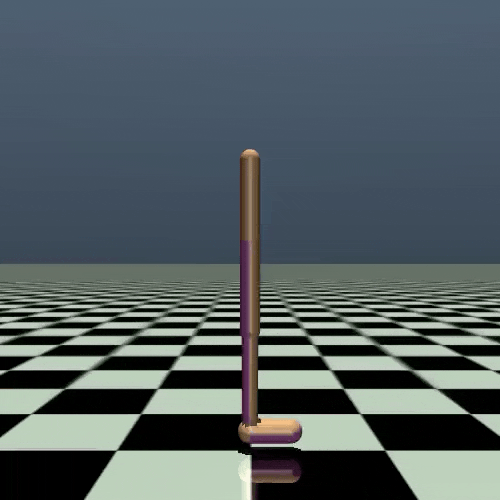

# Proximal Policy Optimization Algorithms

## Training

You can check [`parse_utils.py`](parse_utils.py) to examine available flags and [`config_ppo.yaml`](config_ppo.yaml), [`config_game.yaml`](config_gae.yaml) for hyperparameters.

Run ` python train.py --env <Gym env> --hyperparams <hypr> --seed <random_seed> --surrogate-objective <surrogate_objective>`

e.g. `python train.py --env HalfCheetah-v2 --hyperparams mujoco --seed 1 --log-interval 1 --surrogate-objective clipping`

## Testing

Run `python test.py --env <Gym env> --trained-model <path/to/trained/model> --record-video`

e.g. `python test.py --env HalfCheetah-v2 --trained-model HalfCheetah-v2.pt --record-video`

or without saving a video of last episode `python test.py --env HalfCheetah-v2 --trained-model HalfCheetah-v2.pt`

## Results

### Comparison of Surrogate Objectives

We compare the surrogate objectives by plotting learning curve from 7 environments, 3 random seed.

**Surrogate Objectives**

**Learning Curve**

### Effect of the Entropy

To examine the effect of the entropy bonus, we compare the result of three random seed runs in Walker-2d environment. The learning curve can be found in [`entropy.csv`](entropy.csv)

### 10 Runs of evaluative episode.

After training 1M timesteps of PPO (clipping), we compute the average return of 10 evaluative episodes from 7 environments.

|            Env            | Average Return (std) |
| :-----------------------: | :------------------: |
|      HalfCheetah-v2       |   1316.80 (80.25)    |
|         Hopper-v2         |   1915.84 (544.53)   |
| InvertedDoublePendulum-v2 |   1276.67 (68.95)    |
|    InvertedPendulum-v2    |    782.9 (343.65)    |
|        Reacher-v2         |    -12.45 (2.56)     |
|        Swimmer-v2         |    -38.20 (3.81)     |
|        Walker2d-v2        |   1401.74 (476.82)   |

### Videos

|         HalfCheetah-v2         |         Hopper-v2         |         InvertedPendulum-v2         |
| :----------------------------: | :-----------------------: | :---------------------------------------: |
|  |  |  |

|         Reacher-v2         |         Swimmer-v2         |         Walker2d-v2         |
| :------------------------: | :------------------------: | :-------------------------: |
|  |  |  |

## References

### Implementation

Code for comparing results from [pytorch-a2c-ppo-acktr](https://github.com/ikostrikov/pytorch-a2c-ppo-acktr-gail)

### Paper

- [Proximal Policy Optimization Algorithms](https://arxiv.org/abs/1707.06347), Schulman et al. 2017
- [High-Dimensional Continuous Control Using Generalized Advantage Estimation](https://arxiv.org/abs/1506.02438), Schulman et al. 2016

### Docs

#### OpenAI Spinning Up

- [Proximal Policy Optimization](https://spinningup.openai.com/en/latest/algorithms/ppo.html#pseudocode)
- [Trust Region Policy Optimization](https://spinningup.openai.com/en/latest/algorithms/trpo.html)
- [Vanilla Policy Gradient Algorithm](https://spinningup.openai.com/en/latest/algorithms/vpg.html)
